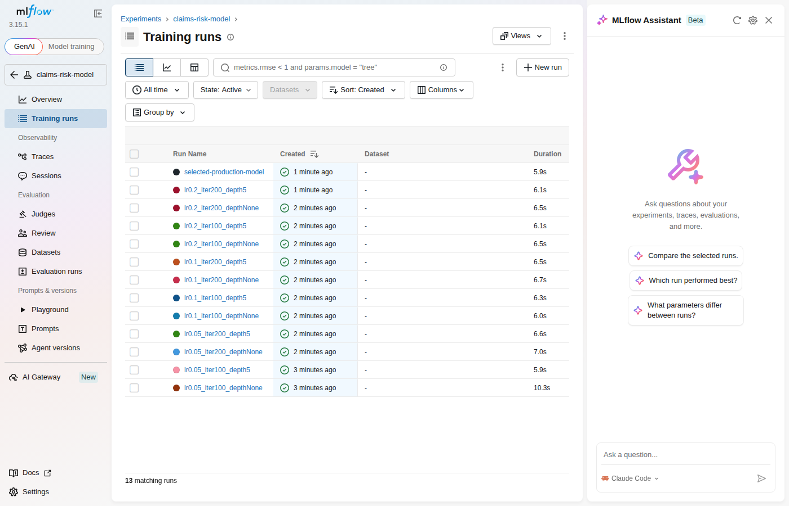

# Swiss Multilingual Claims & Compliance Assistant

A working demonstration of a pipeline that Swiss insurers, and companies with
sizeable insurance/claims operations, actually need: manual document review,
policy verification, and damage-claim triage in Switzerland runs on
CHF 120-220+/hour labor, across documents that arrive in German, French,
Italian, and English, spanning 26 cantonal regulatory regimes. This project
builds the automation layer that sits in front of that manual review --
fast-tracking the low-risk, well-documented, low-value claims and routing
everything else to a human adjuster with the redaction, extraction, and
policy context already done.

**No real insurer is a client or data source for this project.** Company
names in this README (Mobiliar, Zurich Insurance, AXA CH, Helvetia) describe
the market this is built for, not a partnership -- all data used here is
synthetic or generated for testing, stated explicitly below and in every
module's docstring.

## Pipeline

```
Incoming claim: DE/FR/EN text + optional invoice photo + optional damage photo
                              |
                              v
        1. PII redaction (app/pii.py) -- runs BEFORE anything else touches
           the text, including before any LLM call, in line with nFADP /
           FINMA expectations that PII be governed before it leaves the
           system of record.
                              |
              +---------------+---------------+
              v                               v
   2. OCR invoice extraction         3. Multilingual policy RAG
      (app/ocr.py) -- real              (app/rag.py + translate.py) --
      pytesseract OCR against           an adjuster in Lausanne can query
      actual image pixels,              in French and retrieve a policy
      regex-parsed for amount/          clause that was only ever written
      date/reference number             in German at Zurich HQ
              |                               |
              +---------------+---------------+
                              v
        4. Classical-ML risk triage (app/risk.py) -- gradient-boosted
           trees score the claim 0-100; claims under CHF 1000 with a low
           score are auto-approved, everything else is flagged
                              |
                              v
        5. FastAPI microservice (app/main.py), containerized -- returns
           the full pipeline result, or the routing decision alone
```

## What's real, what's synthetic, what's a placeholder

Stated plainly, the same way the other two projects in this portfolio
document their gaps -- this is what makes the "77.3% test accuracy" and
"11 passing tests" claims elsewhere in this portfolio trustworthy: the same
person wrote "this part isn't real yet" when it wasn't.

| Component | Status |
|---|---|
| PII redaction (`app/pii.py`) | **Real.** Rule-based regex + checksum validation (AHV/AVS, Swiss IBAN, phone, email, dates of birth, titled names). Runs against real text, 7/7 tests pass. Narrower than a full NER model on free-text names -- see "What this doesn't catch" below. |
| OCR invoice extraction (`app/ocr.py`) | **Real.** Actual pytesseract OCR against actual image pixels (synthetically rendered invoices, since no real Swiss claims documents were available -- see `scripts/generate_sample_invoice.py`). |
| Multilingual policy RAG (`app/rag.py`) | **Real, with a stated limitation.** Genuinely retrieves cross-lingually (a French query finds a German-only clause) -- verified by tests. *Matching* uses glossary-based query/document expansion (`app/translate.py`), not a multilingual embedding model or real machine translation, so retrieval quality is bounded by a ~25-term curated glossary, not general-purpose -- and this has to stay glossary-based because it needs to handle arbitrary user queries, which can't be pre-translated. Architected with the same 3-tier LLM fallback used in the other two projects, ready to upgrade to real MT without changing the retrieval logic. Separately, once a clause is found, its *answer* can be shown translated into the language the question was asked in (`answer_language` on `/policy-query`, or the "Translate the answer into" dropdown on the demo page). Because the clause corpus is a small, closed set of 9 demo clauses, each one carries hand-authored reference translations (`translations` on each clause) rather than being machine-translated at request time -- fluent, not a word-for-word swap. The glossary-substitution translator is kept as an automatic fallback for any clause without one (`translation_mode` in the response says which path was used: `reference_translation` vs. `glossary_substitution`), so the endpoint degrades gracefully rather than breaking if the dataset grows before translations are added. |
| Risk/fraud triage (`app/risk.py`) | **Real model, synthetic data.** A real HistGradientBoostingClassifier (same family as XGBoost), actually trained and evaluated (held-out AUC ~0.82), but on a synthetic dataset with a hand-specified labeling rule -- there is no real Swiss insurer claims history behind it. This demonstrates the modeling and CHF-threshold routing architecture, not a validated production fraud model. |
| Damage-photo severity (`app/damage_assessment.py`) | **Placeholder, explicitly.** No labeled Swiss claims-photo dataset was available (and none should be assembled from real policyholder photos without consent and a data-processing agreement -- itself part of the point of this project). Returns `mode: "placeholder_not_trained"` rather than a fabricated severity score. |

### What the PII redaction doesn't catch

The name-redaction rule only fires on a title-anchored pattern (Herr/Frau/
Monsieur/Madame/Mr./Mrs./Ms. + capitalized name). A name mentioned without a
title, or an unusual name format, would not be redacted. A production system
would pair this rule-based layer with a real multilingual NER model (e.g.
Microsoft Presidio + a German/French spaCy pipeline) for free-text name
coverage; the structured-PII detectors (AHV number, IBAN, phone, email) are
the reliable part and were prioritized because they carry the clearest legal
exposure if leaked.

## Data protection by construction

Text is redacted (`app/pii.py`) before it reaches the translation or RAG
layer -- the pipeline order in the diagram above is deliberate, not
incidental. `app/translate.py`'s offline glossary-substitution fallback means
the system also functions with zero external API calls, which matters for
the same reason: nFADP and FINMA guidance both push toward not sending
unredacted client data to external services without governance in place.
Containerized (Dockerfile) and designed to run in a Swiss/EU data region
(e.g. AWS `eu-central-2` Zurich or Azure Switzerland North) -- not deployed
to either in this project; see "Live demo" below for where it's actually
hosted.

## A noisy (but harmless) warning during deployment

The build log on Render's free tier shows a scary-looking block during
`scripts/generate_synthetic_claims.py`: joblib's loky backend fails to
detect physical CPU cores in Render's cgroup-limited container ("found 0
physical cores < 1"), prints a `UserWarning`, and falls back to the logical
core count on its own -- the build continues and completes normally. It
reads like a crash because the warning message embeds the internally-caught
exception's traceback for diagnostic detail, not because anything actually
fails. `LOKY_MAX_CPU_COUNT` is set explicitly anyway (`Dockerfile` and
`app/risk.py`) to silence the noise, but the underlying lesson was reading
Render's build log carefully enough to tell an alarming warning apart from
an actual failure, rather than assuming the scarier-looking one.

## Running it

```bash
pip install -r requirements.txt
python scripts/generate_synthetic_claims.py   # generates data + trains + saves the risk model
python scripts/generate_sample_invoice.py      # sample invoice image for testing
uvicorn app.main:app --reload
```

Try it:

```bash
# Redact PII from a claim description and get a risk-based routing decision
curl -X POST localhost:8000/claims/ingest \
  -F "description=Herr Peter Muster meldet einen Wasserschaden. AHV-Nr: 756.1234.5678.97" \
  -F "language=de" -F "prior_claims_count=0" -F "days_since_policy_start=900"

# Same, with an invoice photo -- OCR extracts the amount and reference number
curl -X POST localhost:8000/claims/ingest \
  -F "description=Small claim, clean documentation." \
  -F "invoice_image=@data/sample_invoice.png"

# Ask a policy question in French, get back a clause that's only written in German
curl -X POST localhost:8000/policy-query \
  -H "Content-Type: application/json" \
  -d '{"query": "Quelle est la franchise en cas de dégât d'"'"'eau ?"}'

# Same, but translate the answer back into French too (the language asked in)
curl -X POST localhost:8000/policy-query \
  -H "Content-Type: application/json" \
  -d '{"query": "Quelle est la franchise en cas de dégât d'"'"'eau ?", "answer_language": "fr"}'

# Cross-department view: how many claims were fast-tracked vs. flagged
curl localhost:8000/reports/summary
```

### Tests

```bash
pytest tests/ -v   # 28 passed
```

Covers: PII redaction across 6 entity types including AHV checksum validation
(and confirms non-PII amounts/references are left alone), OCR field
extraction against a real rendered invoice image, cross-lingual retrieval
(3 languages, verified against the actual source-language clause each query
should surface), risk-model training and CHF-threshold routing logic
(including that a large claim is flagged even with a low fraud score), and
the full FastAPI request/response cycle end to end.

### Continuous integration

`.github/workflows/ci.yml` runs on every push and PR to `main`: the full
`pytest` suite, then two smoke tests that actually exercise the real entry
points rather than just unit-testing isolated functions --
`scripts/generate_synthetic_claims.py` (data generation + training end to
end) and `scripts/train_risk_model.py` (the full MLflow-tracked sweep below).
The trained model artifact is uploaded from each run (14-day retention) so a
model produced by CI can be pulled down and inspected without re-running
anything locally.

**A bug this caught:** the first real CI run failed 4 tests with
`pytesseract.pytesseract.TesseractNotFoundError`. `pytesseract` is only a
Python wrapper around the `tesseract` command-line binary -- `pip install`
gets you the wrapper, not the binary, and `ubuntu-latest` runners don't ship
it preinstalled. It had worked in every local run because tesseract happened
to already be on that machine. Fixed by adding a step that installs it via
apt (`sudo apt-get install -y tesseract-ocr`) before the Python dependencies,
which is also why this is a *system* dependency worth calling out separately
from `requirements.txt` -- pip can't install it for you on a fresh machine
either.

### Experiment tracking (MLflow)

`scripts/generate_synthetic_claims.py` trains one model with fixed default
hyperparameters -- the fast path to get the app running. For the actual
question of *which* hyperparameters, `scripts/train_risk_model.py` runs a
small tracked grid (learning rate x max iterations x max depth, 12
combinations) through MLflow: every run's params, held-out AUC, a
permutation-importance plot, and the model itself are logged, then the
best-performing configuration is what actually gets saved to
`models/risk_model.joblib`.

```bash
python scripts/train_risk_model.py
mlflow ui --backend-store-uri sqlite:///mlflow.db   # http://localhost:5000
```



Tracking is local-file-based (a SQLite file, `mlflow.db` -- MLflow's older
plain-directory store is deprecated as of MLflow 3), so this needs zero
external services to run, same principle as everything else in this project
being demoable with zero external keys. The best run in the screenshot above
(`lr0.05_iter100_depth5`, held-out AUC 0.832) is a touch better than the
untuned default (AUC ~0.82 quoted elsewhere in this README) -- a modest gap,
which is itself an honest finding: on a synthetic dataset with this much
label noise built in on purpose, hyperparameter tuning has a ceiling.

### Docker

```bash
docker build -t swiss-claims-assistant .
docker run -p 8000:8000 swiss-claims-assistant
```

### Live demo

Deployed on Render's free tier: **[link added once deployed]**. The root URL
(`/`) is a plain-language demo page -- no API or technical knowledge needed:
submit a sample claim and watch personal data get redacted, a risk score
computed, and a routing decision made; ask a policy question and see it
answered from a clause written in a different language than the question.
Engineers/reviewers who want the raw API instead can go to `/docs` for the
interactive Swagger UI. The free tier spins down after 15 minutes idle; the
first request after a lull takes ~20-30s to wake it back up.

## What I'd do next with more time

- Swap the glossary-substitution translation fallback for a real multilingual
  embedding model or MT API, which would make retrieval quality independent
  of the curated glossary's coverage.
- Replace the synthetic risk-training data with a real (properly consented,
  redacted) claims history, and re-validate the AUC against real outcomes
  rather than a synthetic labeling rule.
- Train a real damage-severity CV model once labeled claims imagery is
  available, following the same "surface `mode` honestly" pattern already
  used for its placeholder.
- Add role-based access so an adjuster only sees claims routed to them, not
  the whole system -- same gap noted in the ERP/CRM project.
